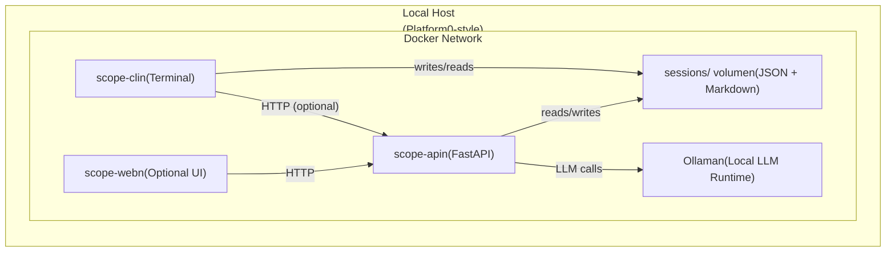

# Local CDE Scope Sketchpad

Local, Docker‑first PCI CDE scoping assistant for assessors and engineers.

The CDE Scope Sketchpad walks you through a small set of structured questions,
captures the answers as JSON, and generates a Markdown “sketch” of your
cardholder data environment – optionally enriched by a local LLM.

Designed to run entirely on your machine, with no third‑party dependencies and
no client data leaving your host.

---

## Why this exists

Most PCI scoping work starts in scattered notes, email threads, and slide decks.

That makes it hard to:

- Reconstruct how you decided what was in scope.
- Reuse scoping patterns across clients and years.
- Plug scoping decisions into downstream tools (evidence trackers, diagrams).

**Local CDE Scope Sketchpad** aims to fix that by providing:

- A **repeatable set of scoping questions**.
- A **structured JSON session** for every run.
- A **Markdown sketch** that can grow into your diagrams and workpapers.
- Optional **local LLM enrichment** for summaries and clarifying questions.

All of this lives in a simple, Docker‑orchestrated stack that fits into a
“Platform0” architecture: stateless worker containers + durable `sessions/`
volume.

---

## Features (v1)

- **CLI flow** for assessors and engineers:
  - ~10–15 opinionated questions about flows, storage, providers, and segmentation.
  - Outputs:
    - `session.json` – structured answers.
    - `sketch.md` – Markdown with a Mermaid diagram skeleton.

- **API service** (FastAPI):
  - Accepts `session.json`.
  - Optionally calls a **local LLM** (via Ollama) to:
    - Summarize scope in plain language.
    - Suggest clarifying questions and risk flags.
  - Returns enriched JSON + updated Markdown sections.

- **Optional web UI**:
  - Simple forms over HTTP to:
    - Fill out the same questions as the CLI.
    - Preview the generated summary and diagram.
    - Download `session.json` and `sketch.md`.

- **Docker‑first**:
  - Single `docker-compose.yml` for CLI + API.
  - Optional overlay compose file for the web UI.
  - Shared `sessions/` volume for all artifacts.

---

## Architecture


- **scope-cli**: interactive CLI, primary entrypoint for power users.
- **scope-api**: central API, owns JSON contracts and all LLM interaction.
- **scope-web** (optional): thin UI speaking only to `scope-api`.
- **sessions volume**: durable store for `session.json` + `sketch.md`.

---

## Repository layout

> This is the target layout; see `sessions/` for generated artifacts.
```text
cde-scope-sketchpad/
  ├── README.md
  ├── LICENSE
  ├── .gitignore
  ├── Dockerfile.api
  ├── Dockerfile.cli
  ├── Dockerfile.web
  ├── docker-compose.yml
  ├── docker-compose.web.yml
  │
  ├── scope_cli/
  │   ├── __init__.py
  │   ├── main.py              # CLI: `python -m scope_cli.main sketch`
  │   └── questions.yaml       # CDE scoping question set
  │
  ├── scope_api/
  │   ├── __init__.py
  │   ├── app.py               # FastAPI app: /health, /enrich
  │   ├── models.py            # Session, EnrichedSession pydantic models
  │   └── llm_client.py        # Ollama HTTP client wrapper
  │
  ├── scope_web/
  │   ├── __init__.py
  │   ├── app.py               # FastAPI + Jinja web UI
  │   └── templates/
  │       ├── index.html       # New session form
  │       └── result.html      # Summary + Mermaid + JSON view
  │
  ├── sessions/                # Generated artifacts (gitignored)
  │   └── .gitkeep             # or empty; ensures dir exists
  │
  ├── examples/
  │   ├── saas-gateway-session.json    # Golden example (to add)
  │   └── saas-gateway-sketch.md       # Example Mermaid sketch
  │
  └── docs/
      └── session.schema.json  # JSON Schema for session objects
```

---

## Quickstart (CLI + API)

### Prerequisites

- Docker Desktop installed and running.
- Ollama installed locally, with at least one model pulled
  (for example `llama3.1:8b`).
- macOS or Linux host recommended.

### 1. Clone the repository
```bash
git clone <REPO_URL>
cd cde-scope-sketchpad
```

### 2. Configure environment (optional)

Copy the example environment file and adjust as needed:
```bash
cp .env.example .env
```

Key variables (examples):
```bash
OLLAMA_HOST=http://host.docker.internal:11434
LLM_MODEL=llama3.1:8b
```

### 3. Start the stack
```bash
docker compose up -d
```

This brings up:

- `scope-api` (FastAPI, listening on `http://localhost:8000`).
- A helper container that can run the CLI.

### 4. Run the CLI
```bash
docker compose run --rm scope-cli scope-sketch
```

You will be guided through a series of questions. At the end you should see
files like:
```text
sessions/
  2025-12-27T01-23-45Z-session.json
  [2025-12-27T01-23-45Z-sketch.md](http://2025-12-27T01-23-45Z-sketch.md)
```

### 5. Enrich via API (optional)

You can send an existing session to the API to generate summaries and
clarifying questions:
```bash
SESSION="sessions/2025-12-27T01-23-45Z-session.json"
curl -X POST http://localhost:8000/enrich \
  -H "Content-Type: application/json" \
  --data @"${SESSION}" \
  -o "sessions/2025-12-27T01-23-45Z-enriched.json"
```

The enriched file may include:

- `summary` – high‑level plain‑language explanation of scope.
- `questions_for_client` – follow‑ups you can ask in the next meeting.
- `notes` – potential risk or ambiguity flags.

---

## Optional Web UI

To enable the web front‑end:
```bash
docker compose -f docker-compose.yml -f docker-compose.web.yml up -d
```

Then open:

- `http://localhost:8080` in your browser.

From the UI you can:

- Start a new scoping session.
- Answer the same questions as the CLI.
- Download `session.json` and `sketch.md`.
- View the generated summary and diagram preview.

---

## Data model

Each scoping run is recorded as a **session**.

High‑level shape (simplified):
```json
{
  "id": "2025-12-27T01-23-45Z",
  "version": "0.1.0",
  "answers": {
    "channels": ["ecommerce", "card-not-present"],
    "stores_pan_anywhere": "no",
    "segmentation_present": "yes"
  }
}
```

The API may add:
```json
{
  "summary": "...",
  "questions_for_client": ["..."],
  "notes": ["..."]
}
```

The associated `sketch.md` file includes:

- Human‑readable notes.
- A Mermaid `flowchart` block that you can extend in your workpapers.

---

## Local LLM integration

By default, `scope-api` assumes a local Ollama instance and a configured model.

Key behaviors:

- If LLM integration is **enabled**:
  - `/enrich` endpoints will call the model and include AI‑generated sections.
- If LLM integration is **disabled or unavailable**:
  - The API still works and returns the original session plus deterministic
    derived fields (no AI content).

The goal is to keep the tool:

- Useful **without** AI.
- More comfortable and expressive **with** AI, while keeping you in control.

---

## Roadmap

Planned improvements (post‑v1):

- Additional flows:
  - SOC 2, ISO 27001, "multi‑standard" scoping templates.
- Exporters:
  - Direct export to diagram tools (PlantUML, draw.io, etc.).
  - Mappings into evidence trackers or engagement databases.
- Deeper Platform0 alignment:
  - Job queue integration.
  - Multi‑tenant run isolation patterns.

---

## License

MIT
